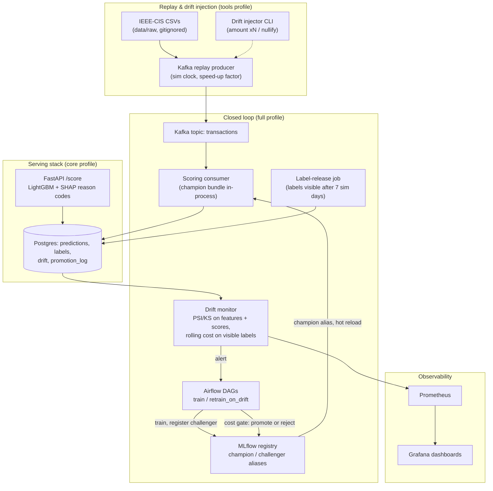

# FraudOps

[](https://github.com/BenBrahimMazen/FraudOps/actions/workflows/ci.yml)

Real-time fraud detection with a **self-healing MLOps loop**: a chronological
replay of the IEEE-CIS card-transaction dataset streams through Kafka, is
scored in real time by a FastAPI service (LightGBM + SHAP reason codes), and
is monitored for feature, score and performance drift (custom PSI/KS +
Evidently, Prometheus/Grafana). When drift trips the retrain trigger, a
challenger is retrained and promoted to champion **only if it beats the
incumbent on a cost-based gate** — every decision logged to MLflow and
Postgres, reversible, with a one-command rollback.

Final-year Data Science / ML-engineering portfolio project. The point is
everything that happens **after** a model is deployed: monitoring, delayed
labels, retraining policy, promotion rules, and the business cost of every
decision. The whole platform runs locally on Docker Compose (MinIO for
S3-compatible storage, LocalStack for AWS emulation) — zero cloud spend.

> **Integrity rule.** Every number in this README comes from a real run of
> this repository and regenerates with the command shown next to it. Nothing
> is estimated, nothing is hand-drawn, and where a result is unflattering it
> is reported anyway (see [Limitations](#limitations)).

---

## Contents

- [Why this project exists](#why-this-project-exists)
- [Headline results](#headline-results)
- [What the project demonstrates](#what-the-project-demonstrates)
- [The closed loop in one pass](#the-closed-loop-in-one-pass)
- [Architecture](#architecture)
- [Getting started](#getting-started)
- [The end-to-end demo](#the-end-to-end-demo)
- [Data discipline: chronological everything](#data-discipline-chronological-everything)
- [The model and the business of fraud](#the-model-and-the-business-of-fraud)
- [Real-time serving](#real-time-serving)
- [Streaming and delayed labels](#streaming-and-delayed-labels)
- [Drift monitoring](#drift-monitoring)
- [The loop closes: one measured promotion](#the-loop-closes-one-measured-promotion)
- [Experiments and figures](#experiments-and-figures)
- [Infrastructure as code and CI/CD](#infrastructure-as-code-and-cicd)
- [Reproducing every number](#reproducing-every-number)
- [Testing strategy](#testing-strategy)
- [Engineering decisions worth defending](#engineering-decisions-worth-defending)
- [Limitations](#limitations)
- [What I would do at real scale](#what-i-would-do-at-real-scale)
- [Dataset](#dataset)

---

## Why this project exists

Most fraud-detection portfolios stop at a notebook with a PR-AUC. In
production, that is where the work *starts*:

- **Models decay.** Fraud behaviour shifts, card portfolios change, and a
  frozen model silently loses ranking quality week over week — this project
  measures that decay (PR-AUC 0.554 → 0.420) instead of assuming it away.
- **Labels are late.** A fraud label (chargeback, investigation outcome)
  arrives days after the transaction. Everything here is evaluated
  *as-of a simulated clock*: no metric ever uses a label that was not yet
  available at that moment.
- **The right threshold is a business decision.** A missed fraud costs its
  transaction amount; a false alert costs analyst review time. The decision
  threshold in this project minimises **expected monetary cost**, not F1 —
  and that choice alone cuts cost 40% below the F1-optimal threshold.
- **Retraining must be governed.** Auto-retraining without a gate can
  replace a decaying champion with something worse. Here a challenger is
  promoted only if it is cheaper *and* no worse at ranking, with the
  decision logged and reversible.

FraudOps runs that entire lifecycle — replay → score → monitor → trigger →
retrain → gate → promote/rollback — as a reproducible local platform, and
publishes the measurements of each stage.

## Headline results

All numbers from real runs on this repository (laptop: AMD Ryzen 5 3500U,
4C/8T, 16 GB RAM, Docker Desktop, Windows 10).

| Result | Measurement |
|---|---|
| Cost saved by one automatic retrain-and-promote cycle | **−21.4%** expected cost/100k on the gate window (232,603 → 182,935), PR-AUC up 0.494 → 0.556 |
| Cost-optimal threshold vs no model (stream) | **211,523 vs 523,315 per 100k** — a 59.6% reduction |
| Cost-optimal vs F1-optimal threshold (stream) | **211,523 vs 352,308 per 100k** — 40% cheaper to run |
| Drift detection lag (amounts ×3 injected at day 165) | PSI **warning in 2 simulated days, alert in 2** (offline monitor semantics); 2/4 days measured live |
| Serving latency | **p50 60 ms / p95 90 ms** per `/score` including top-3 SHAP reasons (target < 100 ms), single worker |
| Throughput envelope (measured, honest) | **~13–15 req/s per worker** — GIL-bound path, documented with Little's-law analysis, zero failures under saturation |
| Replay scale | **94,636 events** replayed in TransactionDT order at **328.6 events/s**, every prediction persisted |
| Tests | **140 automated tests** (leakage guards, train/serve parity, gate logic, API contract, integration replay) — CI green |
| Infrastructure | **11 AWS resources provisioned** by Terraform against LocalStack; ECR/ECS/ALB layer validated + planned |

## What the project demonstrates

- **MLOps lifecycle ownership**: registry-backed champion/challenger serving,
  alias-based promotion, zero-downtime reload, audited decisions, rollback.
- **Streaming engineering**: Kafka (KRaft) producer/consumer, backpressure
  and durability handling, a simulated clock with delayed label release.
- **Monitoring that feeds decisions**: PSI/KS drift on features *and*
  scores, rolling PR-AUC/cost on visible labels only, alert thresholds,
  Grafana dashboards, and a pure-function retrain trigger.
- **Business-aware ML**: cost-based threshold optimisation, cost per 100k
  transactions as a first-class metric, threshold sensitivity to review
  cost measured (not assumed).
- **Evaluation integrity**: chronological splits, as-of label visibility,
  leakage tests in CI, champion judged on the predictions it actually
  served.
- **Production hygiene**: one feature pipeline for train and serve
  (parity-tested), pinned lock file, conventional commits, three-job CI
  (lint+type+tests, Docker build, Terraform validate), IaC that has never
  touched a real cloud account.

## The closed loop in one pass

1. **Replay** — the labelled IEEE-CIS stream split (sim days 150–182) is
   published to Kafka in TransactionDT order, driven by a simulated clock
   (configurable speed-up; 1 sim day ≈ 8 s in the recorded runs).
2. **Score** — the consumer scores every event with the current champion
   (same library the API uses), stores score + decision + top-20 feature
   values per transaction in Postgres.
3. **Label release** — true labels are held back for 7 simulated days, then
   released by a separate job; monitoring only ever sees released labels.
4. **Monitor** — every 15 s: PSI + KS on the top-20 gain features and on
   the score distribution against the champion's training reference;
   rolling PR-AUC and expected cost on the labelled window. Results land
   in Postgres, Prometheus and Grafana.
5. **Trigger** — a pure function decides `should_retrain` (feature PSI
   alerts, score PSI, or performance drop vs the champion's reference).
   The monitor exposes it as a Prometheus gauge; the Airflow DAG consumes
   the same logic from persisted evidence.
6. **Retrain** — the challenger trains on the original train split plus all
   labels released so far (drift injections re-applied, so it learns the
   drifted regime the served model faced).
7. **Gate** — on the most recent fully-labelled window, the champion is
   judged on its *stored production predictions*, the challenger through
   its own pipeline at its own shipped threshold. Promote only if cost
   improves ≥ 1% and PR-AUC does not drop. Decision logged to MLflow and
   `promotion_log`.
8. **Promote / rollback** — the MLflow `champion` alias moves; the API and
   scorer hot-reload it within seconds, no restart. `make rollback` undoes.



One artifact, one decision rule: the model, the feature pipeline and the
cost-optimal threshold ship together as a single MLflow pyfunc. Training
and serving cannot disagree about the decision rule — by construction.

## Architecture

| Area | Choice |
|---|---|
| Language / packaging | Python 3.11, `uv` lock file, one package `fraudops` |
| Model | LightGBM (+ SHAP TreeExplainer reason codes) |
| Serving | FastAPI + Uvicorn, Pydantic v2, Prometheus metrics |
| Streaming | Apache Kafka (KRaft, no ZooKeeper), `confluent-kafka` |
| Orchestration | Apache Airflow (LocalExecutor, Postgres metadata) |
| Registry / tracking | MLflow (Postgres backend, MinIO artifacts) |
| Monitoring | Custom PSI/KS module + Evidently reports; Prometheus + Grafana |
| Storage | PostgreSQL (predictions, labels, drift results, promotion log) |
| IaC | Terraform, provider pinned to LocalStack |
| Quality | pytest (140 tests), ruff, mypy, Locust, GitHub Actions |

```text
fraudops/
  Makefile                       one command per task
  docker-compose.yml             profiles: core | monitoring | full | tools
  configs/                       costs, splits, drift, model (YAML)
  src/fraudops/
    data/                        loading, joins, chronological splits, replay clock
    features/                    the single feature pipeline (train + serve)
    models/                      training, threshold optimisation, evaluation, retraining
    serving/                     FastAPI app, model loader, SHAP reasons, persistence
    streaming/                   Kafka producer, consumer, label release
    monitoring/                  PSI/KS, Evidently, drift injector, trigger logic
    registry/                    MLflow helpers, champion/challenger gate, rollback
    reports/                     figure/table generators behind `make report`
  dags/                          fraudops_train, fraudops_retrain
  infra/terraform/               AWS-shaped stack, applied to LocalStack only
  dashboards/                    Grafana JSON, Prometheus config
  loadtest/                      Locust files
  notebooks/                     exploration only (EDA)
  tests/                         unit + integration (140)
```

## Getting started

Requirements: Python 3.11, [`uv`](https://docs.astral.sh/uv/), GNU `make`
(on Windows: `winget install ezwinports.make`), Docker Desktop.

```bash
git clone https://github.com/BenBrahimMazen/FraudOps && cd FraudOps
# dataset: see the Dataset section below -> data/raw/{train_transaction,train_identity}.csv
uv sync        # create the locked virtualenv (or: make install)
make lint      # ruff check + format check
make typecheck # mypy over src/fraudops (46 files, clean)
make test      # pytest — 140 tests in ~4 min
make data      # validate the two CSVs in data/raw/
make train     # local run: load -> split -> features -> LightGBM -> threshold -> evaluation -> MLflow
make up        # core stack: postgres, minio, mlflow, api  (http://localhost:8000/docs)
make bootstrap # train + register + set the first champion (inside the stack)
make up-full   # + airflow, kafka, scorer, labels, monitor, prometheus, grafana
```

Exploration notebook: `notebooks/01_eda.ipynb` (executed outputs committed)
— class balance over time, missingness, amount distribution over time.

## The end-to-end demo

From `make up-full` with a champion bootstrapped, this is the recorded
closed-loop sequence (all timings from the runs cited above):

```bash
make drift-amount FACTOR=3 FROM_DAY=165   # arm a synthetic amount shift
make replay DAY_SECONDS=8                 # replay the stream (~5 min, 94,636 events)
```

- Watch drift fire: Grafana at `http://localhost:3000` (dashboards
  provisioned), or Prometheus `fraudops_drift_psi` at `:9090`.
  The ×3 shift raises `log_TransactionAmt` PSI from ≤ 0.08 to 0.19
  (warning, day 167) to 0.46 (alert, day 169) and sustains ≥ 0.93 after.
- Trigger the retrain: Airflow UI at `http://localhost:8080` (admin
  password: `docker compose exec airflow cat ~/standalone_admin_password.txt`),
  DAG `fraudops_retrain` — or drive it externally off the
  `fraudops_drift_trigger` gauge.
- The DAG retrains, evaluates the gate, and (as measured in the recorded
  run) promotes: `make status` shows champion v3, `GET /model` flips to the
  new version ~16 s after the gate decision, no restarts.
- Undo it: `make rollback`.

Then regenerate every figure and table in this README:

```bash
make report     # 6 figure groups from raw data + live databases
make loadtest   # Locust envelope on /score
```

## Data discipline: chronological everything

The IEEE-CIS training file (~590k transactions, ~3.5% fraud) is split by
the simulated clock derived from `TransactionDT` — never randomly:

| split | sim days | rows | fraud rate | used for |
|---|---|---|---|---|
| train | 0–119 | 410,601 | 3.51% | fitting model + feature statistics |
| validation | 120–149 | 85,303 | 3.47% | threshold selection only |
| stream | 150–182 | 94,636 | 3.47% | replayed "live", never used for tuning |

Rules enforced by tests, not convention:

- **Leakage guards**: train timestamps strictly precede validation, which
  strictly precede the stream; the feature pipeline is fitted on the train
  split only.
- **As-of label visibility**: every evaluation query filters
  `available_at <= simulated_now`. A metric at day 170 can never see a
  label released at day 172 — the same rule the label-release job enforces.
- **Train/serve parity**: the exact same pipeline object transforms rows in
  training, in the API, and in the streaming consumer; a parity test feeds
  identical inputs through both paths and requires identical features.
- The competition's unlabelled `test_*` files are never used for
  evaluation.

## The model and the business of fraud

Cost model (`configs/costs.yaml`): a missed fraud costs its
`TransactionAmt`; a false alert costs a fixed 5.0 review cost. The decision
threshold minimises **expected total cost on validation** — PR-AUC, recall
at 1% FPR and expected cost per 100k are the primary metrics; ROC-AUC and
F1 are reported for reference only.

`make train` (baseline, one command, reproducible with fixed seeds):

| window | PR-AUC | ROC-AUC | recall @1% FPR | model cost /100k | no-model /100k | fixed 0.5 /100k | F1-optimal /100k |
|---|---|---|---|---|---|---|---|
| train | 0.988 | 0.999 | 0.993 | 117,737 | 510,174 | 8,377 | 28,199 |
| validation | 0.595 | 0.918 | 0.528 | **188,073** | 578,902 | 282,208 | 340,315 |
| stream | 0.500 | 0.884 | 0.442 | **211,523** | 523,315 | 325,717 | 352,308 |

Reading it honestly:

- The 0.988 → 0.595 train/validation gap is **deliberate overfitting left
  unpruned**: no early stopping, because validation is reserved for
  threshold selection. Nothing looks suspiciously good on unseen data.
- The cost-optimal threshold beats all three baselines on validation *and*
  on the stream — 40% below the F1-optimal threshold, 60% below no model.
- At review cost 5.0 the optimum alerts ~27% of transactions —
  mathematically correct (average fraud ≈ 149) but operationally high; the
  threshold-sensitivity experiment below quantifies exactly that trade-off.
- Validation → stream decay (PR-AUC 0.595 → 0.500) is the *natural drift*
  the monitoring layer tracks and the retraining loop acts on.

## Real-time serving

API contract (interactive docs at `http://localhost:8000/docs`):

| endpoint | behaviour |
|---|---|
| `POST /score` | `fraud_probability`, `decision` (cost-optimal threshold), `threshold`, `model_version`, `top_reasons` (top-3 SHAP: feature, value, signed log-odds), `latency_ms` |
| `POST /score/batch` | up to 1,000 transactions, ~4 ms/row amortised |
| `GET /health`, `GET /model` | liveness; champion version, threshold, training window, metrics |
| `GET /metrics` | Prometheus: request counts, latency histograms, decisions, score distribution |
| `POST /admin/reload` | force champion reload (token-protected) |

Operational properties, measured on the running stack:

- **Latency**: p50 60.4 ms / p95 92.7 ms steady-state (60 single-user
  calls, Docker, champion v1, 500 trees / 96 features), *including* SHAP
  reasons — computed in one fused LightGBM `pred_contrib` call, not a
  second pass. Target p95 < 100 ms: met. Under concurrency see the
  load test in the experiments section.
- **Zero-downtime reload**: a background poller swaps the champion
  atomically when the MLflow alias changes (≤ 15 s) or `/admin/reload`
  forces it. In the recorded promotion, `/model` showed v3 **16 s** after
  the gate decision; first request after a swap pays ~1.3 s lazy warmup,
  then 51–82 ms.
- **Non-blocking persistence**: every scored transaction goes to Postgres
  through a bounded queue and batch writer — scoring never blocks on the
  database (drops counted, never raised).
- **Fail-safe**: 503 with a clear error while no champion exists; invalid
  input rejected by Pydantic schemas; batch limit enforced.

## Streaming and delayed labels

The replay producer publishes the stream split in `TransactionDT` order at
a configurable speed-up; simulated time travels in the payload. Recorded
run (`make replay DAY_SECONDS=8`):

- **94,636 events, 328.6 events/s**, 94,636 of 94,636 predictions stored,
  1,892,720 feature rows (top-20 features per prediction), 28,508 alerts
  (30.1%) at threshold 0.0296.
- **Labels never travel on the topic.** The producer stages them in
  `labels_pending`; the release job moves them to `labels` once the
  simulated clock passes `TransactionDT + 7 days`. Final state:
  76,759 released + 17,877 pending = 94,636 exactly.
- A drift-injector CLI arms synthetic shifts for the producer to apply
  (`make drift-amount FACTOR=3 FROM_DAY=165`, `make drift-nullify
  COLS=card4 FROM_DAY=165`), so detection lag is measurable against a
  known ground truth. Natural drift in the data is observed, not hidden.

Two production-grade bugs were found and fixed during live verification —
the kind only a real end-to-end run surfaces:

1. **Kafka message timestamps** — the producer stamped dataset-epoch
   *seconds* where Kafka expects *milliseconds*: every message dated
   1970-01-01, so retention saw "56-year-old" data and the broker's
   5-minute sweep deleted live segments under the lagging scorer, twice
   (31,936 then 38,440 predictions silently skipped — offsets committed,
   lag 0, no errors anywhere). Fix: no message timestamps; simulated time
   lives in the payload, which consumer, label release and monitor already
   read. Side effect: throughput 188.7 → 328.6 events/s.
2. **Consumer tail freeze** — `consumer.poll(0.2)` once blocked 8+ minutes
   on a librdkafka-internal futex (SIGINT traceback pinned it), and the
   last 136 predictions reached Postgres only via the shutdown flush.
   Fix: idle-branch flush + a 5 s watchdog flusher thread; the scorer now
   restarts unless-stopped. A hung `poll()` still stalls consumption until
   restart — documented, not hidden.

## Drift monitoring

Every 15 s the monitor computes, on a trailing 7-sim-day window, against
the champion's **training reference** (bins fitted on the train split):

- **Feature drift**: PSI + KS on the top-20 features by LightGBM gain,
  PSI warn > 0.1 / alert > 0.2 (`configs/drift.yaml`).
- **Score drift**: PSI on the predicted-probability distribution.
- **Performance**: rolling PR-AUC and expected cost on labelled rows only,
  with the lookback spanning window + label delay (a prediction becomes
  labelable exactly when it ages out — an off-by-window bug caught live
  and regression-tested).
- Everything lands in `monitoring_results` (Postgres), Prometheus and the
  Grafana dashboard; Evidently HTML reports via `make report-evidently`.

**Injected shift, detected as designed** (amounts ×3 from sim day 165,
87 monitor cycles recorded):

| sim day | `log_TransactionAmt` PSI | level |
|---|---|---|
| 150–166 | 0.004 – 0.081 | ok |
| 167 | 0.188 | **warning** — 2 sim days after injection |
| 169 | 0.460 | **alert** — 4 sim days after |
| 170 → 182 | 0.93 → 1.61 | sustained alert |

Two honest findings:

- **Score drift never fired**: score PSI stayed ≤ 0.039 across the whole
  replay (warning level is 0.1). The champion's probability distribution
  was stable under both the ×3 shift and heavy natural feature drift —
  **feature drift ≠ score drift**, which is exactly why the trigger waits
  for performance evidence and the gate decides, rather than auto-promoting
  on any PSI spike.
- **Natural drift was alerting from day 150**: browser/OS metadata
  (`id_31`, `id_30`, `id_33`, PSI up to 7.4), `DeviceInfo` (2.6),
  `R_emaildomain` (2.3) — the train window and the stream differ enough in
  device mix to trip a fixed reference continuously. That is population
  change, which a fixed-reference PSI is *meant* to flag; the trigger
  logic combines it with performance rather than retraining on every
  blip.

## The loop closes: one measured promotion

With the ×3 shift armed and the replay finished, the full loop ran end to
end (DAG `fraudops_retrain`, four tasks green, 2026-09-29):

1. **Trigger** — re-derived from persisted monitor evidence via the same
   pure `should_retrain`: 5 top-20 features above PSI 0.2 (worst `id_31`
   4.48, `log_TransactionAmt` 1.58), labelled PR-AUC 0.989 → **0.494**,
   cost 117,360 → **232,603**/100k on the trailing window; score PSI 0.019
   (quiet, as above).
2. **Retrain** — challenger trained on train split + all released stream
   labels (injection re-applied so it learns the drifted regime), threshold
   tuned on a chronological labelled slice *before* the gate window — never
   on the window being judged.
3. **Gate** — most recent fully-labelled window (sim days 168–175,
   n = 19,943, features rebuilt with the live injection applied):

| window sim days 168–175 (n = 19,943) | PR-AUC | cost / 100k |
|---|---|---|
| champion v1 (as served) | 0.494 | 232,603 |
| challenger v3 (retrained, threshold 0.0838) | 0.556 | **182,935** |
| gate rule | must not drop | must improve ≥ 1% |

**Decision: promoted** — cost −21.4%, PR-AUC up. Logged with both models'
metrics to MLflow and `promotion_log`; the challenger alias cleared
automatically; the API and scorer hot-reloaded (16 s, no restart); the
monitor rebuilt its reference for v3 on the next cycle.

The gate itself is a pure function with table-driven tests — promote,
reject, tie-within-margin, PR-AUC-loss-blocks — plus registry-level tests
for alias moves and rollback. A deliberately worse challenger is rejected
in the test suite; the DAG is manual (`schedule=None`) because a standing
injection keeps a fixed-reference trigger permanently hot (documented, and
the gauge exists for an external scheduler).

**Why the orchestrator never loads a serving model.** Airflow installs the
package under its own constraints (numpy 1.x) while serving images install
the project lock (numpy 2.x); cloudpickle artifacts embed numpy internals,
so a serving-pickled model cannot be unpickled under Airflow — verified
the hard way (`ModuleNotFoundError: numpy._core.numeric`). The DAG
therefore reads the champion's reference metrics from its MLflow run and
judges it on its **stored production predictions**. Cross-check: those
stored-prediction metrics matched an independent rescore from raw data
exactly (PR-AUC 0.494, cost 232,603, n = 19,943).

## Experiments and figures

One command regenerates every figure and table below from raw data plus
the live databases: `make report` (each script also standalone as
`uv run python -m fraudops.reports.<name>`; every arm logged to MLflow
experiment `fraudops_experiments`). Hardware for all measurements: AMD
Ryzen 5 3500U (4C/8T laptop), 16 GB RAM, Docker Desktop VM ≈ 8.8 GB,
Windows 10, API container without CPU/memory limits.

### 1. Frozen-model decay — `reports/figures/decay_curve.{csv,png}`

Champion v1 judged only on what it actually served (stored scores joined
to labels released 7 sim days later), trailing 7-day windows stepped one
day — the monitor's own window shape.

PR-AUC erodes 0.554 (window ending day 157) → 0.420 trough (day 170) →
0.494 (day 175), always below the 0.595 validation reference: the model
arrived already degraded and kept sliding. Expected cost/100k climbs
208k → 283k (peak day 173) → 233k while the alert rate creeps 26.8% →
33.5% — the model drifts toward crying wolf, each false alert still
costing 5.0. The ×3 injection (day 165) shows up more sharply in cost
than PR-AUC: tripling amounts triples the price of every miss without
moving ranking quality much, and 7-day windows straddle the boundary so
nothing is a step change.

### 2. Retraining policies — `reports/figures/retrain_comparison.{csv,png}`

Three policies over the labelled replay (sim days 150–175, 76,649
transactions). Each retrain rebuilds exactly what that moment could know
(`as_of` label visibility) and fits through the same `fit_challenger` the
live DAG uses; the no-retraining arm is the frozen champion's actual
served record.

| policy | retrains | total cost 150–175 | active window | cost/100k (active) | PR-AUC (active) |
|---|---|---|---|---|---|
| no retraining (v1 as served) | 0 | 174,355 | — | 227,676 (whole period) | 0.494 |
| scheduled weekly | 1 — at day 171 | 171,340 | 171–175 | 180,905 | 0.538 |
| drift-triggered (PSI alert) | 1 — at day 169 | 169,412 | 169–175 | 207,855 | 0.519 |

The 7-day label delay dominates the whole comparison: the shift lands at
day 165 but its **labels only exist from day 172**, so neither retrain
trained on the drift itself — both improve through fresher natural-drift
labels and a re-tuned threshold (0.081 / 0.115 vs v1's 0.0296, far fewer
false alerts once amounts are tripled). The weekly schedule **starves**
before it starts — ticks at day 157 (no labels visible) and day 164 (the
7 visible days entirely consumed by threshold validation) are skipped
exactly as a real scheduler would; a 14-day cadence never gets a usable
window in this horizon. The triggered arm wins on total cost (169.4k vs
171.3k) because it takes over two days earlier and covers the champion's
two worst days — not because it knows more about the drift. The best model
of all was the live loop's v3, trained once drifted labels existed
(cutoff day 168): 182.9k/100k at PR-AUC 0.556. Honest caveat: single seed,
single replay — the 2–3% margins between arms are within plausible seed
variance.

### 3. Threshold sensitivity to review cost — `reports/figures/threshold_sensitivity.{csv,png}`

The shipped threshold (review cost 5.0) lands at 0.029609 — exactly the
baseline's 0.0296, reproduced by the same `optimal_cost_threshold` the
trainer uses.

| review cost | optimal threshold | alert rate | recall | cost /100k |
|---|---|---|---|---|
| 1 | 0.0083 | 42.5% | 94.7% | 65,696 |
| 5 | 0.0296 | 26.7% | 89.2% | 188,073 |
| 10 | 0.1514 | 10.8% | 74.0% | 253,740 |
| 25 | 0.4708 | 4.0% | 59.6% | 314,625 |

The operating point is extremely sensitive to the review cost — a 25×
change moves the threshold 56× and halves recall. Missed fraud stays the
dominant cost share everywhere (37–85%), so even at review cost 25 the
optimum is not "alert on nothing". At review cost 5 (average fraud ≈ 149)
the optimum tolerates a 27% alert rate; teams with human review capacity
would sit nearer the cost-10 row.

### 4. Detection lag by injected shift — `reports/figures/detection_lag.{csv,png}`

Six scenarios replayed offline through the exact monitor semantics (v1
reference, top-20 features, PSI warn 0.1 / alert 0.2, trailing 7-day
windows), each with only its own injection applied:

| scenario | warning lag | alert lag | max PSI |
|---|---|---|---|
| amount ×1.5 | 3 d | 4 d | 0.54 |
| amount ×2 | 3 d | 4 d | 0.66 |
| amount ×3 (the live one) | 2 d | 2 d | 1.60 |
| amount ×5 | 1 d | 2 d | 2.82 |
| nullify C13 | 6 d | 6 d | 0.31 |
| nullify P_emaildomain | masked | masked | 25.76 |

Bigger shifts are caught faster (×5 warns within a day; ×1.5 takes three);
subtle corruption takes ~6 days — PSI needs the window to fill with
shifted data before the histogram moves. The ×3 offline row (2-day alert)
is a lower bound on the live measurement (warning day 167, alert day 169):
offline windows are complete simulated days while the live monitor
evaluates partial windows as the replay clock moves. `nullify
P_emaildomain` is **masked**: that channel was already in natural-drift
alert before the injection (first warning day 157 < 165), so its own lag
is not measurable — a real caveat of fixed-reference monitoring, shown
rather than hidden. Score PSI never crossed 0.1 in any scenario (max 0.054
at ×5): again, feature drift ≠ score drift.

### 5. Load test — Locust on `POST /score`

Saturation profile (no think time), full stack running (12 containers
incl. monitor and Airflow), **single Uvicorn worker**, Locust on the host.
Headline run `make loadtest USERS=50 RUN_TIME=2m`; smaller user counts
from the same file.

| concurrent users | requests | throughput | p50 | p95 | p99 | failures |
|---|---|---|---|---|---|---|
| 1 | 675 | 15.0 /s | 60 ms | **90 ms** | 140 ms | 0 |
| 10 | 882 | 14.8 /s | 650 ms | 960 ms | 1.0 s | 0 |
| 25 | 776 | 13.2 /s | 1.8 s | 2.7 s | 3.0 s | 0 |
| 50 | 1,362 | 11.5 /s | 3.7 s | 5.9 s | 13.0 s | 0 |

Reading it honestly: the **p95 < 100 ms target is met for a single
concurrent request** (90 ms p95), and the service never errors under
saturation — but it saturates at **~13–15 req/s** regardless of offered
concurrency, latency growing linearly in the queue (Little's law holds at
every level). The cause is structural: one Uvicorn worker, and a `/score`
path dominated by GIL-bound Python (Pydantic validation, DataFrame build,
pandas transform) around a native TreeSHAP call that releases the GIL for
only part of the work — the process serialises at roughly one request per
single-request latency. Four cores cannot help one Python process. What
would move it: multiple workers (one model copy each), a non-pandas hot
path, or `/score/batch` (~4 ms/row amortised). Documented as the
deployment's real capacity envelope: correct and predictable, but
single-process.

### 6. SHAP summary and reason codes — `reports/figures/shap_summary.png`, `reason_codes.md`

Champion v3 explained on a 5,000-transaction labelled sample (sim days
168–175, seed 42). Three example `/score` outputs, top-3 features by
|contribution| exactly as the API computes them:

| case | score | decision | top reasons (log-odds) |
|---|---|---|---|
| highest score | 0.999 | alert (actual fraud) | `C1`=5.0 +2.06, `C14`=0 +1.51, `C13`=0 +1.24 |
| borderline | 0.084 | approve (actual legit) | `card1`=11298 +1.21, `C5`=1 −0.69, `log_TransactionAmt` +0.64 |
| lowest score | 0.000 | approve (actual legit) | `DeviceInfo` −2.14, `card1` −1.60, `card3` −1.35 |

The beeswarm shows anonymised counters (`C1`, `C13`, `C14`, `C5`) and
`card1`/`card3` doing most of the work, with amount contributing
positively. Reason codes are technical, not analyst narratives — an honest
consequence of the anonymised schema (see Limitations), and the borderline
case shows why: `card1` pushing +1.2 toward fraud with no business gloss a
reviewer could act on.

## Infrastructure as code and CI/CD

`infra/terraform/` describes a plausible AWS deployment of the serving
side: an S3 bucket for MLflow artifacts (versioned, SSE, lifecycle), ECR +
ECS Fargate (2 tasks) behind an ALB with `/health` checks, least-privilege
IAM execution/task roles, and a CloudWatch log group. Managed services
(RDS, MSK, the MLflow server) are deliberately *not* described — their
endpoints are injected through `var.api_environment`, as they would be at
real scale.

**This has never been applied to real AWS.** The provider block is pinned
to a LocalStack endpoint variable with all credential/metadata checks
skipped, and the apply evidence comes from the containerized workflow:

```bash
make tf-init     # terraform init inside hashicorp/terraform:1.9 (nothing on the host)
make tf-validate # terraform validate
make tf-apply    # docker compose --profile tools up -d localstack, then apply
```

What applied to LocalStack (Community license — zero cost, no token):
**11 resources, 0 errors** — S3 bucket + versioning + SSE + lifecycle,
IAM execution role (+ managed policy), task role (+ read-only artifacts
policy), CloudWatch log group, both security groups.

The ECR/ECS/ALB layer is gated behind `enable_compute` (default `false`)
because LocalStack Community does not implement ECS or ELBv2 — both
require the paid Pro license, which the zero-cost rule rules out — and
its ECR rejects static test credentials. That layer is verified by
`terraform validate` in CI and by:

```bash
make tf-plan-compute   # terraform plan -var enable_compute=true -> 7 to add
```

Two LocalStack quirks were hit and worked around or documented (this is
what "applied against LocalStack" actually teaches): Moto does not
implement the `default-vpc` DescribeSubnets filter (equivalent `vpc-id`
filter used), and lifecycle-configuration creation takes ~55 s to settle.

CI (`.github/workflows/ci.yml`) runs three jobs on every push and PR:
**lint-and-test** (ruff, mypy, 140 pytest tests), **docker-build** (the
serving image compiles — build-only, never pushes) and
**terraform-validate** (fmt, init, validate).

State stays local (`*.tfstate*` gitignored); the provider lock file is
committed for reproducibility.

## Reproducing every number

| Claim / artifact | Command (prereqs: `uv sync`, data in `data/raw/`) |
|---|---|
| Baseline table (PR-AUC, cost/100k, all baselines) | `make train` → `reports/` |
| Decay curve (fig. 1) | `make report` → `reports/figures/decay_curve.{csv,png}` |
| Retraining policies (fig. 2) | `make report` → `retrain_comparison.{csv,png}` |
| Threshold sensitivity (fig. 3) | `make report` → `threshold_sensitivity.{csv,png}` |
| Detection lag (fig. 4) | `make report` → `detection_lag.{csv,png}` |
| Load-test envelope (fig. 5) | `make loadtest USERS=50 RUN_TIME=2m` → `reports/figures/locust_*` |
| SHAP summary + reason codes (fig. 6) | `make report` → `shap_summary.png`, `reason_codes.md` |
| Serving latency / reload | `make up`, then `GET /model`, `/metrics`; the promotion timing is in `promotion_log` |
| Closed-loop demo (alert → retrain → gate → promote) | `make up-full`, arm drift, `make replay`, trigger `fraudops_retrain`; `make status` |
| Terraform apply evidence | `make tf-apply` (LocalStack only) |
| Tests / lint / type-check | `make test` / `make lint` / `make typecheck` |

Figures regenerate from raw data in one command; nothing is drawn or
transcribed by hand. Retraining-policy reports re-fit challengers on the
historical stream using the same as-of label visibility the live loop
uses.

## Testing strategy

**140 tests**, green in CI (`make test`):

- **Chronology & leakage**: split-boundary guards (train strictly precedes
  validation precedes stream); feature statistics fitted on train only.
- **Train/serve parity**: identical inputs through the training and
  serving paths must produce identical features.
- **Cost & threshold logic**: cost function and optimiser edge cases —
  no fraud in window, all fraud, degenerate score distributions.
- **Drift statistics**: PSI and KS on synthetic distributions with known
  answers (shifted, identical, disjoint).
- **Retrain trigger**: pure function, table-driven over monitor-evidence
  combinations.
- **Champion/challenger gate**: promote, reject, tie-within-margin,
  PR-AUC-loss-blocks, alias moves, rollback restores the previous
  champion.
- **Label delay**: release arithmetic against the simulated clock;
  as-of visibility cutoff equals `now − delay`.
- **API contract**: valid input, invalid input, model unavailable, batch
  limit (1,000), admin-token enforcement.
- **Integration**: a small Kafka replay (`--max-events`) through producer,
  scoring and storage, asserting row counts land in Postgres.
- **Regressions from live incidents**: monitor window lookback (window +
  delay), label-release arithmetic, injector parity between producer and
  gate evaluation.

## Engineering decisions worth defending

- **One artifact, one decision rule.** Model + pipeline + threshold ship
  as a single MLflow pyfunc; training and serving cannot diverge.
- **Optimise for money, not F1.** The threshold minimises expected cost —
  40% cheaper than the F1-optimal point on the same model and data.
- **As-of everywhere.** Every evaluation filters labels by simulated
  availability; the retraining experiments rebuild each historical
  decision with only the labels that existed then.
- **Judge the champion on what it served.** The gate reads the champion's
  stored production predictions, not a fresh rescore — deployment reality,
  not a proxy (and the cross-check matched the rescore exactly).
- **The orchestrator never unpickles a serving model.** A numpy 1.x/2.x
  constraint became a design rule: metrics come from MLflow, the champion
  from its own stored predictions.
- **Feature drift alone retrains nothing.** PSI alerts open the case;
  performance evidence and the cost gate decide it — score PSI stayed
  ≤ 0.039 through a ×3 amount shift while features screamed.
- **No entity-aggregation features, on purpose.** Card/address
  fingerprinting features would blur the leakage story the project is
  built to tell; the trade-off (leaderboard-grade PR-AUC) is declined
  explicitly.
- **Labels off the stream.** Truth travels through a release job, never
  the Kafka topic — mirroring how chargeback labels actually arrive.

## Limitations

Maintained honestly from day one; every claim above traces to a run.

- **Baseline overfits by design** (0.988 train vs 0.595 validation
  PR-AUC): no early stopping or hyperparameter search, to keep validation
  reserved for threshold selection and the stream untouched by tuning.
- **Feature set is deliberately small**: no anonymised V-columns and no
  group-key aggregation features; leaderboard-grade PR-AUC is explicitly
  not the goal.
- **Serving is single-process**: one Uvicorn worker meets the p95 < 100 ms
  target per request at low concurrency but saturates at ~13–15 req/s
  under load (GIL-bound path; measured envelope above). Multiple workers
  or a non-pandas hot path would raise the ceiling at the cost of one
  model copy per process.
- **Airflow runs as a single container** (`standalone`, LocalExecutor) —
  a local-scale deployment, not a production Airflow topology; the package
  installs under Airflow's constraint set, so pandas/fastapi versions
  differ from the application lock inside that one image.
- **The full stack + retraining brushes the Docker-VM memory ceiling**
  (~8.6 GB allocated): the retrain task peaks near 2 GB on top of Airflow,
  the monitor (~2 GB) and the rest. One DAG run was OOM-killed during task
  spawn before the monitor was stopped for the duration of retraining; the
  recorded closed-loop run completed with ~1 GB spare.
- **Cross-environment model artifacts**: models logged under Airflow's
  constraints load in serving images with loud version-mismatch warnings,
  not silently; the reverse direction fails outright — which is why no
  Airflow task ever loads a serving model.
- **One promotion is demonstrated live**, not a long series: rejection and
  tie paths are covered by unit tests on the pure gate function, but the
  recorded run promoted on its first decision.
- **Terraform's compute layer is validate/plan-verified only**: LocalStack
  Community does not implement ECS or ELBv2, so the ECR/ECS/ALB resources
  have never been created by an apply.
- **CI is static**: lint, type-check, unit tests, Docker build and
  `terraform validate` — the compose-stack integration path (Kafka replay,
  promotion gate on a live registry) runs locally, not in GitHub Actions.
- **Replay, not production traffic**: volumes, arrival patterns and fraud
  behaviour are simulated; the speed-up factor distorts time further.
- **Anonymised features**: most IEEE-CIS columns carry no business
  meaning; SHAP reason codes are technical, not analyst narratives.
- **Single machine**: all latency/load numbers are laptop-specific
  (hardware documented alongside each figure).
- **Not for real use**: research/portfolio project, not intended for real
  financial decisions.

## What I would do at real scale

Grounded in what this project actually measured, not generic advice:

- **Serving**: the measured ~13–15 req/s ceiling per worker is GIL-bound
  (Pydantic validation + pandas transform + TreeSHAP). First run N
  Uvicorn workers / ECS tasks (the model is MBs — one copy per process is
  fine, and the Terraform layer already models `desired_count = 2` for
  this reason), then move the hot path off pandas, pre-size SHAP to
  top-k features, and only then consider ONNX or a compiled scorer. The
  p95 < 100 ms target was met per-request; it is *throughput* that needs
  the scale-out.
- **Labels**: the 7-day delayed-label dance was the project's central
  constraint — every evaluation is as-of a simulated clock. In production
  the label source is chargebacks/investigation outcomes with real
  arrival-time semantics, and the as-of join becomes the most
  business-critical code in the repo.
- **Streaming**: one Kafka partition was fine for a replay; real
  ingestion would key transactions by card/account so per-entity features
  (velocity, spend patterns) become possible — the deliberately small
  feature set here has none.
- **Retraining cadence**: drift-triggered beat fixed schedules mainly
  because the trigger fired *sooner* after the shift; with real label
  delays the lever is shortening feedback latency, not more aggressive
  triggers.
- **Deployment safety**: promotions here flip one alias with a gate; at
  real scale I would shadow-score the challenger on live traffic before
  any promote, canary the new threshold (the alert-rate budget is very
  sensitive to threshold moves — see the sensitivity figure), and keep the
  rollback runbook automated.
- **Infrastructure**: SSM/Secrets Manager for the admin token (the tf
  file carries a placeholder), private subnets + NAT instead of the
  default VPC with public IPs, MSK/RDS/MLflow as managed endpoints, and
  the drift injector replaced by replaying real historical incidents as
  regression fixtures.

## Dataset

**IEEE-CIS Fraud Detection** (Kaggle competition data, governed by Kaggle's
rules — accepted per account, so the download is manual; `data/` is
gitignored and never committed).

1. Sign in at [kaggle.com](https://www.kaggle.com).
2. Accept the competition rules once:
   <https://www.kaggle.com/competitions/ieee-fraud-detection/rules>
3. Download the two labelled training files (links work in your browser
   while signed in and after accepting the rules):
   - [train_transaction.csv.zip](https://www.kaggle.com/api/v1/competitions/data/download/ieee-fraud-detection/train_transaction.csv.zip) (~139 MB)
   - [train_identity.csv.zip](https://www.kaggle.com/api/v1/competitions/data/download/ieee-fraud-detection/train_identity.csv.zip) (~27 MB)
4. Extract both so the layout is exactly:

   ```
   FraudOps/data/raw/train_transaction.csv
   FraudOps/data/raw/train_identity.csv
   ```

Expected: ~590,540 data rows in `train_transaction.csv`, ~144,233 in
`train_identity.csv` (left-joined on `TransactionID`). Only these two
training files are used; the competition's `test_*` files carry no labels
and are never used for evaluation.
