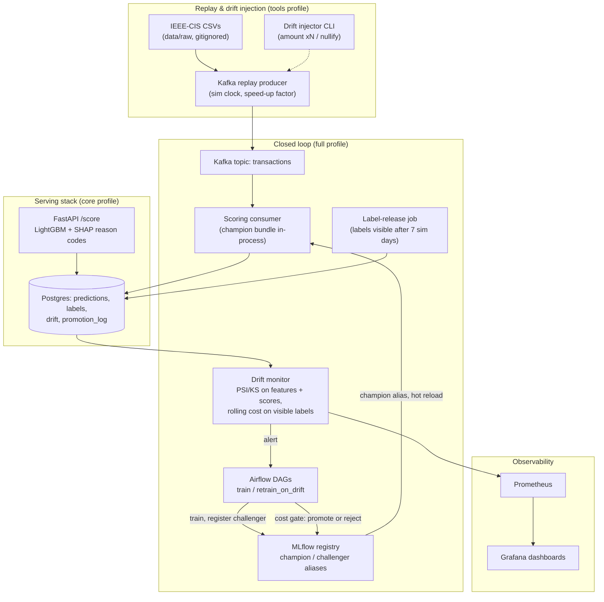
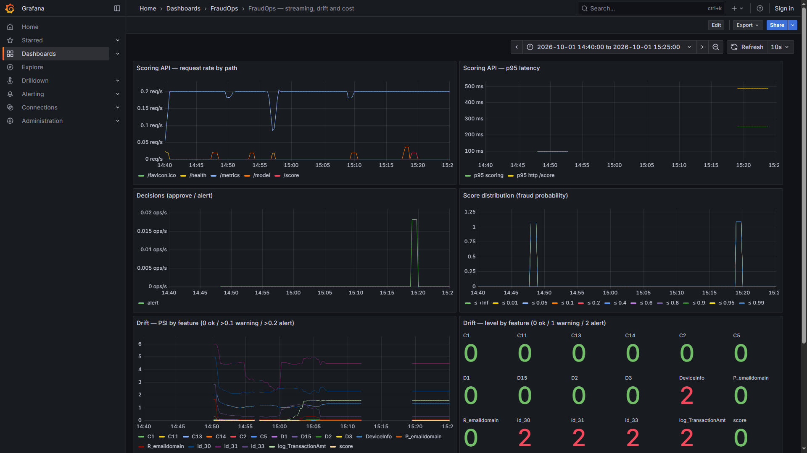
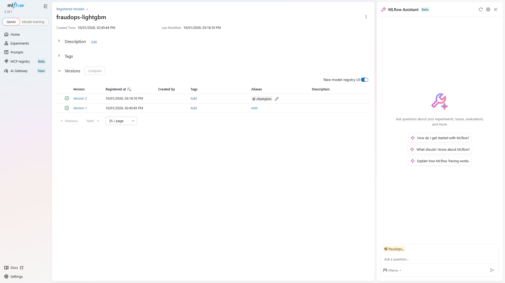

# FraudOps

[](https://github.com/BenBrahimMazen/FraudOps/actions/workflows/ci.yml)


Real-time fraud detection with a **self-healing MLOps loop**: a Kafka
replay of the IEEE-CIS card-transaction dataset is scored live by FastAPI
(LightGBM + SHAP reason codes), monitored for feature/score/performance
drift (PSI/KS + Evidently, Prometheus/Grafana), and when drift trips the
trigger a challenger is retrained and promoted **only if it beats the
champion on business cost** — every decision logged, reversible,
rollback in one command.

## Headline results

Measured on this repo (laptop: Ryzen 5 3500U, 16 GB RAM, Docker Desktop):

| | |
|---|---|
| Cost cut by one automatic retrain → gate → promote cycle | **−21.4%** (232,603 → 182,935 per 100k), PR-AUC up 0.494 → 0.556 |
| Cost-optimal vs F1-optimal threshold (stream) | **40% cheaper** (211,523 vs 352,308 per 100k) |
| Cost-optimal vs no model (stream) | **59.6% cheaper** (211,523 vs 523,315 per 100k) |
| Drift detection lag (amounts ×3 injected) | PSI **warning + alert within 2 sim days** (offline); 2/4 days live |
| Serving latency | **p50 60 ms / p95 90 ms** per `/score` incl. top-3 SHAP reasons (target < 100 ms) |
| Throughput envelope (honest) | **~13–15 req/s per worker**, zero failures under saturation |
| Replay scale | **94,636 events**, 328.6 events/s, every prediction persisted |
| Tests | **140** (leakage guards, train/serve parity, gate logic, API contract, integration replay) |
| Infrastructure | Terraform: **11 AWS resources applied to LocalStack**, compute layer validated + planned |

## The loop



1. **Replay** — the stream split (sim days 150–182) is published in
   `TransactionDT` order under a simulated clock.
2. **Score** — the consumer scores every event with the champion (same
   library the API uses) and stores score + decision + top-20 features.
3. **Labels arrive late** — truth is held 7 sim days, then released by a
   separate job; monitoring only ever sees released labels.
4. **Monitor** (every 15 s) — PSI/KS on top-20 features and the score
   distribution vs the champion's training reference; rolling PR-AUC and
   cost on labelled rows.
5. **Trigger** — a pure `should_retrain` function (feature PSI alerts,
   score PSI, or performance drop), exposed as a Prometheus gauge.
6. **Retrain** — challenger learns from train split + all labels released
   so far (drift injections re-applied).
7. **Gate** — champion judged on its *stored production predictions*,
   challenger through its own pipeline at its own shipped threshold.
   Promote only if cost improves ≥ 1% and PR-AUC does not drop.
8. **Promote / rollback** — MLflow `champion` alias moves; API and scorer
   hot-reload within seconds; `make rollback` undoes.

Model, feature pipeline and threshold ship as **one MLflow artifact** —
training and serving cannot disagree about the decision rule.

## Quickstart

Requires Python 3.11, [`uv`](https://docs.astral.sh/uv/), GNU `make`,
Docker Desktop; dataset in `data/raw/` (see [Dataset](#dataset)).

```bash
uv sync        # locked virtualenv
make lint typecheck test   # ruff + mypy + 140 pytest tests
make train     # baseline: load -> split -> features -> LightGBM -> threshold -> MLflow
make up        # core stack: postgres, minio, mlflow, api  (docs: localhost:8000/docs)
make bootstrap # train + register + set the first champion
make up-full   # + airflow, kafka, scorer, labels, monitor, prometheus, grafana
```

## Demo: watch it self-heal

```bash
make drift-amount FACTOR=3 FROM_DAY=165   # arm a synthetic amount shift
make replay DAY_SECONDS=8                 # ~5 min, 94,636 events
```

- Grafana (`localhost:3000`): `log_TransactionAmt` PSI 0.08 → 0.19
  (**warning**, day 167) → 0.46 (**alert**, day 169), sustained ≥ 0.93.
  (Re-run end-to-end from a wiped stack on 2026-10-01: warning day 167 at
  0.19, alert from day 168, peaking 0.96 — same detection profile.)
- Trigger `fraudops_retrain` in the Airflow UI (`localhost:8080`): it
  retrains, evaluates the gate, promotes — `GET /model` flips to the new
  champion **16 s** after the gate decision, no restarts.
- `make rollback` undoes it. `make report` regenerates every figure.

From the 2026-10-01 re-run — `log_TransactionAmt` PSI crossing warning then
alert while other features stay flat:



## Demo: standalone scoring API

The serving layer also runs as a single container with the champion baked
in — no Postgres, MinIO or Kafka, just scoring with SHAP reasons:

```bash
make demo-export   # download the live @champion into demo/model
make demo-build    # build the self-contained image
make demo-run      # http://localhost:7860/docs
```

`POST /score` needs only `TransactionID`, `TransactionDT`, `TransactionAmt`
(everything else is treated as missing); `GET /model` shows the champion's
threshold and gate metrics.

## Results

### Baseline: optimise for money, not F1

Chronological split (train days 0–119: 410,601 rows / validation 120–149:
85,303 / stream 150–182: 94,636, all ~3.5% fraud). A missed fraud costs its
amount, a false alert costs 5.0 (`configs/costs.yaml`); the threshold
minimises expected cost on validation. `make train`:

| window | PR-AUC | model cost /100k | no-model /100k | fixed 0.5 /100k | F1-optimal /100k |
|---|---|---|---|---|---|
| validation | 0.595 | **188,073** | 578,902 | 282,208 | 340,315 |
| stream | 0.500 | **211,523** | 523,315 | 325,717 | 352,308 |

The 0.988 train PR-AUC is deliberate overfitting left unpruned (no early
stopping — validation is reserved for threshold selection); validation →
stream decay (0.595 → 0.500) is the natural drift the loop acts on.

### The loop closes: one measured promotion

×3 shift armed, replay finished, retrain DAG triggered (sim days 168–175,
n = 19,943):

| | PR-AUC | cost / 100k |
|---|---|---|
| champion v1 (as served) | 0.494 | 232,603 |
| challenger v3 (retrained) | 0.556 | **182,935** |

**Promoted** (−21.4% cost, PR-AUC up), logged to MLflow + `promotion_log`;
API hot-reloaded 16 s later. Rejection, tie-within-margin and
PR-AUC-loss-blocks paths are unit-tested on the pure gate function.
The whole loop was re-run from a wiped stack (2026-10-01): identical
champion metrics (232,603 / 0.494 — it judges the same stored predictions),
challenger promoted at 179,641 (+22.8%) — the margin is single-seed
variance, the decision is the same.



### Retraining policies (label delay is the real constraint)

76,649 labelled replay transactions, each policy retrains with only the
labels visible at that moment:

| policy | retrains | total cost | cost/100k (active window) |
|---|---|---|---|
| no retraining (v1 as served) | 0 | 174,355 | 227,676 |
| scheduled weekly | 1 (day 171) | 171,340 | 180,905 |
| drift-triggered | 1 (day 169) | **169,412** | 207,855 |

The ×3 shift lands day 165 but its **labels only exist from day 172** —
no policy could train on the drift itself. The triggered arm wins by
taking over 2 days earlier; the weekly schedule starves at its first two
ticks (no labels / all consumed by threshold validation). Single seed,
single replay: 2–3% margins are within seed variance.

### Drift detection lag

| injected shift | warning | alert | max PSI |
|---|---|---|---|
| amount ×1.5 | 3 d | 4 d | 0.54 |
| amount ×3 (live one) | 2 d | 2 d | 1.60 |
| amount ×5 | 1 d | 2 d | 2.82 |
| nullify C13 | 6 d | 6 d | 0.31 |
| nullify P_emaildomain | masked¹ | masked¹ | 25.76 |

¹ already in natural-drift alert before the injection — a real caveat of
fixed-reference monitoring, shown not hidden. **Score PSI never crossed
0.1 in any scenario** (feature drift ≠ score drift): PSI alerts open the
case, performance evidence and the gate decide it.

### Threshold sensitivity to review cost

| review cost | threshold | alert rate | recall | cost /100k |
|---|---|---|---|---|
| 1 | 0.0083 | 42.5% | 94.7% | 65,696 |
| 5 | 0.0296 | 26.7% | 89.2% | 188,073 |
| 10 | 0.1514 | 10.8% | 74.0% | 253,740 |
| 25 | 0.4708 | 4.0% | 59.6% | 314,625 |

A 25× change in review cost moves the optimal threshold 56× — the
operating point is a business input, not a model property.

### Load envelope — Locust on `/score` (single Uvicorn worker)

| users | throughput | p50 | p95 | failures |
|---|---|---|---|---|
| 1 | 15.0 /s | 60 ms | **90 ms** | 0 |
| 10 | 14.8 /s | 650 ms | 960 ms | 0 |
| 50 | 11.5 /s | 3.7 s | 5.9 s | 0 |

p95 target met per-request; the ceiling is structural — one GIL-bound
worker (Pydantic + pandas + TreeSHAP) serialises at ~1 request per
single-request latency. Fix: more workers / non-pandas hot path /
`/score/batch` (~4 ms/row). Reported as-is: correct and predictable, but
single-process.

### SHAP reason codes (as `/score` returns them)

| case | score | top reasons (log-odds) |
|---|---|---|
| highest | 0.999 | `C1` +2.06, `C14` +1.51, `C13` +1.24 |
| borderline | 0.084 | `card1` +1.21, `C5` −0.69, `log_TransactionAmt` +0.64 |
| lowest | 0.000 | `DeviceInfo` −2.14, `card1` −1.60, `card3` −1.35 |

Technical, not analyst narratives — an honest consequence of the
anonymised schema.

### Bugs only a live run finds

- **Kafka timestamps in the wrong unit** made every message look
  56 years old; retention deleted live segments twice (70k predictions
  silently skipped — offsets committed, no errors). Fix: simulated time
  travels in the payload. Throughput 188.7 → 328.6 events/s.
- **A `poll()` call hung 8 min on a librdkafka futex** and the write
  buffer never flushed at idle. Fix: watchdog flusher every 5 s +
  `restart: unless-stopped`.

## Reproduce every number

| artifact | command |
|---|---|
| baseline tables | `make train` |
| decay curve, retraining policies, threshold sensitivity, detection lag, SHAP | `make report` → `reports/figures/` |
| load envelope | `make loadtest USERS=50 RUN_TIME=2m` |
| closed-loop promotion | `make up-full` + demo above; decision in `promotion_log` |
| terraform evidence | `make tf-apply` (LocalStack only) |
| quality gates | `make lint typecheck test` |

## What's inside

| area | choice |
|---|---|
| model | LightGBM + SHAP TreeExplainer |
| serving | FastAPI + Uvicorn, Pydantic v2, Prometheus metrics |
| streaming | Kafka (KRaft), `confluent-kafka` |
| orchestration | Airflow (LocalExecutor, Postgres metadata) |
| registry | MLflow (Postgres backend, MinIO artifacts) |
| monitoring | custom PSI/KS + Evidently; Prometheus + Grafana |
| storage | PostgreSQL (predictions, labels, drift, promotion_log) |
| IaC | Terraform pinned to LocalStack (never real AWS) |
| quality | pytest (140), ruff, mypy, Locust, GitHub Actions |

`src/fraudops/` — `data/` (loading, splits, replay clock) · `features/`
(the single train+serve pipeline) · `models/` (training, threshold
optimisation, retraining) · `serving/` (API, loader, SHAP, persistence) ·
`streaming/` (producer, consumer, label release) · `monitoring/` (PSI/KS,
injector, trigger) · `registry/` (gate, rollback) · `reports/` (figures).

**API contract** (`localhost:8000/docs`): `POST /score` (probability,
decision, threshold, model version, top-3 SHAP reasons, latency),
`POST /score/batch` (≤ 1,000), `GET /health`, `/model`, `/metrics`,
`POST /admin/reload` (token). Every scored transaction is persisted;
scoring never blocks on the database (bounded queue + batch writer).

## Engineering decisions worth defending

- **One artifact, one decision rule** — model + pipeline + threshold ship
  together; no train/serve skew by construction (parity-tested).
- **Judge the champion on what it served** — the gate reads its stored
  production predictions, not a rescore (cross-check matched exactly).
- **The orchestrator never unpickles a serving model** — an numpy 1.x/2.x
  constraint became a design rule; metrics come from MLflow and Postgres.
- **Feature drift alone retrains nothing** — score PSI stayed ≤ 0.039
  through a ×3 shift while features screamed; the gate decides.
- **No entity-aggregation features, on purpose** — they would blur the
  leakage story; leaderboard-grade PR-AUC explicitly declined.
- **Labels off the stream** — truth arrives via a release job under the
  simulated clock, mirroring how chargeback labels actually arrive.

## Testing

140 tests, green in CI: chronological split + leakage guards, train/serve
feature parity, cost function and threshold optimiser edge cases (no
fraud / all fraud), PSI/KS on synthetic distributions with known answers,
table-driven trigger logic, gate promote/reject/tie/rollback, label-delay
arithmetic vs the simulated clock, API contract (invalid input, model
unavailable, batch limits, admin token), and an integration replay
(producer → scoring → Postgres).

CI: lint + type-check + tests, Docker image build (never pushes), and
`terraform validate` on every push and PR.

## Limitations

- Baseline overfits by design (0.988 train vs 0.595 validation PR-AUC) —
  validation is reserved for threshold selection.
- Deliberately small feature set (no V-columns, no card/address
  aggregations); leaderboard-grade PR-AUC is not the goal.
- Serving is single-process: ~13–15 req/s ceiling (measured envelope
  above); p95 < 100 ms holds per-request.
- Airflow runs as a single `standalone` container — local topology, and
  the package installs under Airflow's constraint set (numpy 1.x) there.
- Terraform's ECR/ECS/ALB layer is validate/plan-verified only —
  LocalStack Community doesn't implement ECS/ELBv2 (Pro-only, paid).
- One promotion demonstrated live; rejection/tie paths covered by tests.
- CI is static — the compose-stack integration path runs locally.
- Replay, not production traffic; single machine; anonymised features
  make SHAP codes technical, not narrative.
- Research/portfolio project — not for real financial decisions.

## What I would do at real scale

- **Serving**: N workers/ECS tasks first (model is MBs — one copy per
  process is fine; the Terraform layer already models `desired_count=2`),
  then a non-pandas hot path; ONNX only after that.
- **Labels**: chargeback arrival-time semantics; the as-of join becomes
  the most business-critical code in the repo.
- **Streaming**: key by card/account to unlock per-entity features
  (velocity, spend patterns) — deliberately absent here.
- **Retraining**: the lever is shortening label feedback latency, not more
  aggressive triggers (that is what actually decided the policy comparison).
- **Deployment safety**: shadow-score challengers on live traffic, canary
  the new threshold (alert-rate budget is threshold-sensitive), automated
  rollback.
- **Infrastructure**: SSM for secrets, private subnets + NAT, managed
  MSK/RDS/MLflow, real incidents replayed as regression fixtures.

## Dataset

**IEEE-CIS Fraud Detection** (Kaggle; `data/` is gitignored, never
committed). Sign in at [kaggle.com](https://www.kaggle.com), accept the
rules once (<https://www.kaggle.com/competitions/ieee-fraud-detection/rules>),
then download while signed in:

- [train_transaction.csv.zip](https://www.kaggle.com/api/v1/competitions/data/download/ieee-fraud-detection/train_transaction.csv.zip) (~139 MB)
- [train_identity.csv.zip](https://www.kaggle.com/api/v1/competitions/data/download/ieee-fraud-detection/train_identity.csv.zip) (~27 MB)

Extract so the layout is `data/raw/train_transaction.csv` and
`data/raw/train_identity.csv` (~590,540 + ~144,233 rows; left-joined on
`TransactionID`). Only these two labelled training files are used; the
competition's unlabelled `test_*` files are never used for evaluation.
